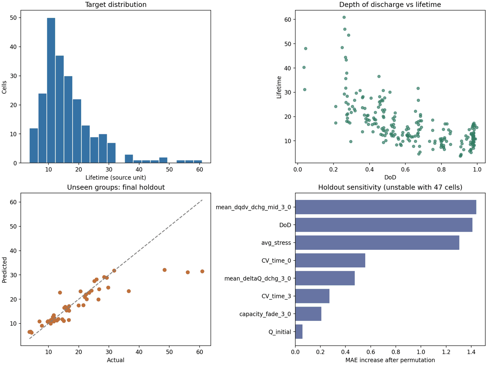

# 배터리 셀 수명 예측 | 실험군 단위 검증

초기 열화 특성과 충·방전 조건으로 배터리 셀의 수명(`Lifetime`)을 예측했다. 같은 실험군의 셀은 조건과 특성이 유사하므로 **실험군을 통째로 분리**해 새로운 조건에 대한 성능을 평가했다.

| 항목 | 결과 |
|---|---|
| 데이터 | 225개 셀 · 60개 실험군 · 원본 열 32개 |
| 최종 모델 | 핵심 피처 10개 + 표준화 + RBF-SVR |
| 훈련군 내부 4-fold GroupKFold | MAE **3.127** |
| 보류한 12개 실험군(47개 셀) | MAE **3.582** · RMSE **6.893** · R² **0.672** |
| 같은 보류군의 중앙값 예측 기준선 | MAE **8.897** |

> MAE와 RMSE는 원본 `Lifetime` 값의 단위다. CSV에 시간 단위가 명시되어 있지 않아 시간·일·개월 등으로 환산하지 않았다. 이 결과는 **공개 데이터에 대한 탐색적 검증**이며 실제 배터리 수명 보증 성능을 뜻하지 않는다.



## 문제와 데이터

원본 데이터는 Li *et al.*의 [Predicting Battery Lifetime Under Varying Usage Conditions from Early Aging Data](https://github.com/tingkai-li/early-prediction-varying-usage-data) 저장소에 공개된 [`feature_all.csv`](https://github.com/tingkai-li/early-prediction-varying-usage-data/blob/main/feature_extraction/feature_all.csv)다. 이 저장소의 [`upload/feature_all.csv`](upload/feature_all.csv)는 원본과 바이트 단위로 동일하다(Git blob SHA: `6a86cea3f3c0ae3d859cdc8c79dc9ace9da7e1b3`). 원본 저장소의 라이선스는 [CC0 1.0](https://github.com/tingkai-li/early-prediction-varying-usage-data/blob/main/LICENSE)이며, 원시 실험 자료는 [ISU-ILCC Battery Aging Dataset](https://doi.org/10.25380/iastate.22582234)을 참조한다.

원본 [피처 추출 코드](https://github.com/tingkai-li/early-prediction-varying-usage-data/blob/main/feature_extraction/feature_extraction.py)는 보간한 용량이 0.2에 도달하는 시점을 `Lifetime`으로 산출한다. 이 프로젝트는 논문의 모델·실험 분할을 재현한 것이 아니라, **공개 피처 표를 사용해 별도로 모델을 비교한 분석**이다.

- **입력:** 충·방전율, 방전 깊이(DoD), 초기 용량, CV 시간과 초기 열화 관련 지표 등
- **타깃:** 셀별 `Lifetime` 연속값
- **단위:** 셀 225개, 실험군 60개. `Cell`·`Group`은 모델 입력에서 제외하고, `Group`은 검증 분할에만 사용
- **기본 점검:** 결측값·중복 셀·완전 중복 행 없음. 타깃 중앙값 14.387, 범위 3.724–60.891

## 검증 설계

1. `GroupShuffleSplit(random_state=42)`으로 **48개 군·178개 셀**을 개발용으로, **12개 군·47개 셀**을 최종 평가용으로 분리했다.
2. 개발용 데이터에서만 4-fold `GroupKFold`로 피처 조합과 모델 하이퍼파라미터를 선택했다. 기준 지표는 MAE다.
3. 선택한 모델을 개발용 데이터 전체에 재학습한 뒤, 분리해 둔 12개 군에서 한 번 평가했다.

같은 군의 셀이 학습과 검증에 함께 들어가는 무작위 셀 분할은 이 프로젝트의 목표인 **처음 보는 실험 조건**의 성능을 평가하기에 적합하지 않다. 선택 모델의 개발용 데이터에서 무작위 셀 CV MAE는 2.945, 그룹 CV 재예측 MAE는 3.132였다. 두 수치의 차이만으로 누수를 증명하는 것은 아니지만, 분할 방식에 따라 결과가 달라짐을 보여준다.

## 피처 선택과 모델 탐색

식별자·타깃을 뺀 수치 29개를 그대로 사용하는 경우부터 초기 측정값을 줄인 경우, 비율·차이·상호작용을 추가한 경우까지 **피처 조합 4종**을 비교했다. 각 조합에 Ridge, RBF-SVR, ExtraTrees, HistGradientBoosting **모델 4종**의 하이퍼파라미터 격자를 적용했다.

| 피처 조합 | 구성 | 해당 조합의 최고 모델 | 그룹 CV MAE |
|---|---|---|---:|
| `lean` | 조건·초기 용량·CV 시간·초기 열화 지표 등 10개 | **RBF-SVR** | **3.127** |
| `engineered` | 원본 29개 + 파생 피처 11개 | ExtraTrees | 3.157 |
| `raw` | 수치 피처 29개 | ExtraTrees | 3.198 |
| `operational` | 초기 3회 변화량을 제외한 조건·초기 측정 피처 | ExtraTrees | 3.305 |

선택 모델은 `lean` 피처의 **RBF-SVR**(`C=10`, `epsilon=1`, `gamma=0.01`)이다. 10개 입력은 `Chg C-rate`, `Dchg C-rate`, `DoD`, `Q_initial`, `CV_time_0`, `CV_time_3`, `capacity_fade_3_0`, `mean_deltaQ_dchg_3_0`, `mean_dqdv_dchg_mid_3_0`, `avg_stress`다. 표준화와 결측 처리기는 파이프라인에 넣어 학습 fold에서만 적합했다. 이번 탐색에서 파생 피처 11개를 추가한 조합은 선택 모델보다 MAE가 낮지 않았다.

전체 설정과 점수는 [`model_search.csv`](model_search.csv)에 있다. 위 CV 점수는 동일한 개발 데이터에서 여러 후보를 비교해 얻은 값이므로 낙관적일 수 있다.

## 최종 평가와 실패 사례

| 방법 | 보류군 MAE ↓ | RMSE ↓ | R² ↑ |
|---|---:|---:|---:|
| 개발용 타깃 중앙값 예측 | 8.897 | 13.447 | -0.248 |
| 선택한 RBF-SVR | **3.582** | **6.893** | **0.672** |

**가장 큰 실패는 `G1`이다.** 이 군의 평균 절대오차는 17.66이고, 최고 수명 셀의 실제값 60.891에 대한 예측은 31.47이다. `G1`을 제외한 보류 셀의 MAE는 2.27이지만, 이는 오류 원인을 살펴보기 위한 **사후 분석값**이며 대표 성능으로 제시하지 않는다. 모델은 특히 장수명 조건을 과소예측할 위험이 있다. 학습 데이터의 최고 수명은 53.541이었다.

추가 진단에서 `G1` 전 셀의 초기 열화 관련 피처 3개가 학습군의 각 피처 범위를 벗어났고, 같은 0.5C/0.5C 조건의 학습군 `G2`와는 DoD가 달랐다. `G1` 안에서도 실제 수명은 31.728–60.891로 벌어지는 반면 예측은 31.162–32.125에 몰렸다. **확인된 것은 입력 분포 차이와 큰 군내 편차이며, 과소예측의 단일 원인을 확정한 것은 아니다.** 셀별 비교와 다음 확인 과제는 [G1 실패 진단](docs/G1_failure_analysis.md)에 정리했다.

보류군 12개를 재표본한 군 단위 bootstrap에서 MAE의 2.5–97.5% 범위는 **1.70–6.53**이다. 표본 군이 적어 성능 추정이 크게 흔들릴 수 있으며, 이 범위를 정밀한 모집단 신뢰구간으로 해석하지 않는다. 셀별 결과는 [`holdout_predictions.csv`](holdout_predictions.csv)에서 확인할 수 있다.

보류군 순열 중요도에서 `mean_dqdv_dchg_mid_3_0`, `DoD`, `avg_stress`의 민감도가 높았다. 서로 연관된 입력이 있어 순위는 불안정하며 인과 효과를 뜻하지 않는다([전체 결과](holdout_permutation_importance.csv)).

## 적용 전 확인할 사항

- **피처 가용 시점:** `CV_time_3` 등 초기 측정값이 실제 예측 시점에 확보되는지 원본 추출 과정과 운영 절차를 대조해야 한다.
- **고수명 조건:** `G1`의 실험 조건·측정 품질·유사 군과의 차이를 확인하고, 독립적인 장수명 실험군으로 과소예측을 재검증해야 한다.
- **현장 의사결정:** 허용 오차와 과소·과대예측 비용을 정한 뒤, 별도 배치나 장비의 데이터에서 검증해야 한다. 이 단계 전에는 수명 보증이나 충전 조건 추천에 사용하지 않는다.

## 재현 방법

`upload/feature_all.csv`가 포함되어 있다. 저장소 루트에서 다음을 실행하면 모델 탐색과 보고서 그림을 다시 생성한다.

```bash
python -m pip install -r requirements.txt
python battery_lifetime_analysis.py
python make_battery_report.py
python g1_diagnostics.py
```

주요 출력은 `battery_results/`에 저장된다. `model.joblib`은 실행 시 생성되며 저장소에는 포함하지 않았다. 저장된 모델을 다른 스크립트에서 불러올 때 `feature_builder.py`가 같은 Python 경로에 있어야 한다.

